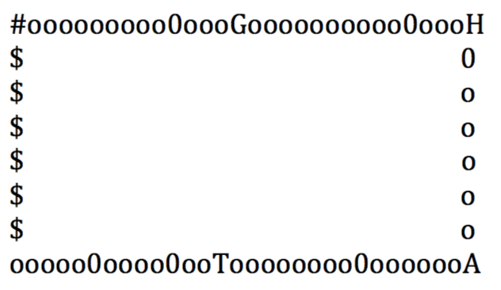

#This is your lovely homework
Basically , we planned two versions homework for you.The first one we think is mainly about summarize almost every part we learned in the training , while the second one is most focused on design patterns and refactor based Test Driven Development. It's up to you to pick a perfect homework for yourself. In the meantime , any kind of innovation is welcome, which means whatever new requirements you think is good for the scenario.

Good luck and don't forget to complete this home work before the next class.If you got any questions please ask @Honglai or your corresponding buddy for help .

#1. Book selling website

##Requirements guideline
1. Backend should be Java based , SpringMVC framework is strongly recommended.
2. Home page should show all the books, should allow customer to search by book name.
3. If customer click the book in the home page , should go to see the details about this specific book. Here both front end route (refer to angular route) and backend route(detail page is another separate page) are recommended.
4. Customer should be able to add any book to their shopping cart. Shopping cart should always be visible on the top of the page with some summary infos.
5. Shopping cart summary infos should contains : Book count, total price.
6. Customer should be able to go to the details shopping cart page by click the shopping cart area.
7. In shopping cart detail page , customer should see everything inside the shopping cart , and should be able to remove or add every book's quantity. after the quantity reduced to 0, the book should no longer exist in shopping cart page .
8. In shopping cart page , customer should be able to submit order and then will got a success page (still , both front end route or backend route are welcome).
9. Success page should display a summary of what customer purchased .

The webs page design is 100% up to you , and you are welcome to add whatever useful features you think is good for our customer.

##Hint
1. There is one important concept called "SESSION" in this project. Session means one period of time server is communicating with some specific client , and server side is able to remember some status of the client within one session.

2. If you want to add a login for our website , it's strongly recommended to use the one called Spring Security , which is quite interesting.

3. It's ok we use some hard coded product catalog (which describes all the products' info), but would be better if we make it possible to use some configuration file like XML, JSON or whatever you think is good.
4. This project is 60% similar with the project you gonna join in TWU , the only difference is we don't use any database at this moment, but if you are curious enough, don't hesitate to import the database layer.

#2. Richest in the world
Richest in the world is one PC game I played when I was a student. It's Chinese name is called "富甲天下", it's quite similar with the game "大富翁". In this game , there are three kings mr.Liu, mr.Cao and mr.Sun which refers to the very famous book "Three Kindoms".Players can pick up one of them as the role to play.
##Requirements guideline
1. This is a command line game
2. Player's first step is to choose a role to play, here players have three options : mr.Liu, mr.Cao and mr.Sun
3. Each king have 5 initial generals, and each general have one attribute : attack (the most important parameter during the battle).
4. The map should be something like this:

The meaning of each letter as below:

1. \# is start point , every player start from here .
2. $ is bonus, when player arrived bonus, got random bonus from 200~2000 (up to you)
3. 0 is city, when player arrived blank city, system should ask the player whether he wants to occupy the blank city. If player replied yes(Y), he need to assign at least one general as the commander of the city.
4. Once one city is occupied by one player, the 0 changed to the player role's name like L for Mr.Liu and C for Mr.Cao
5. When player arrived some other player's city, he need to pay the pass fee or he chose to fight against the general in the city, if he win he don't need to pay anything, otherwise, pay double pass fee. Usually the general with higher attack will win in the fighting (but not every time).
6. When player arrived his own city, he could use some money to upgrade the city, then the city's pass fee will grow to double.
5. G is casino, once player arrived here, he got one chance to gamble, first system question should be "how much money you want to gamble ?" and player put some money to gamble. Second system output is to let player known if the gamble is win or lose. For loss case, player got nothing back, if player win the gamble, got 2 times bonus.
6. H is hotel, once customer arrived here, system should invite 3 generals to player, and ask if they want to buy one of them.
7. A is arsenal, player who arrived here got one chance to buy one weapon out of 5 options, and the weapon could be assigned to one specific general to upgrade his/her attack. Each general is only allowed to have one weapon in hand at one time.
8. T is supermarket, customer could buy some props here. There are 3 kinds of props: TP (player can use TP to transfer to any position in the map), Barricade(disable other player from pass the barricade, instead they start move backwards after meet the barricade) and Hypnosis (to disable one other play from doing any action)
9. o is normal area, nothing happens if player arrived (or you can add something , up to you)
10. once one general is assigned to some city, which means he is not along with the king, and then he can not be able to fight for the king directly when the king arrived some other king's area and are asking for the pass fee.
11. once one player don't have enough money to pay the pass fee, and lose the fight, one of his general (in some city or along with him) will leave. If he have no more generals in hand, the player game over.

Evert round, player can chose :

1. PROPS: use some props
2. ROLL: roll and then move 1~6 steps randomly
3. QUERY: query current player's info (cities, generals, money, props ..)
4. QUERY ALL: query all player's info
5. QUIT: quick the game.
